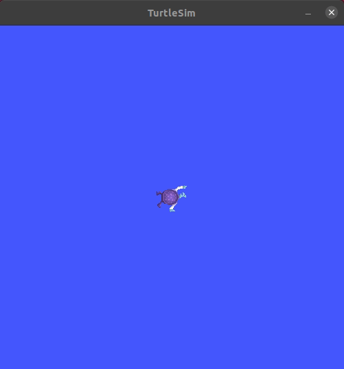
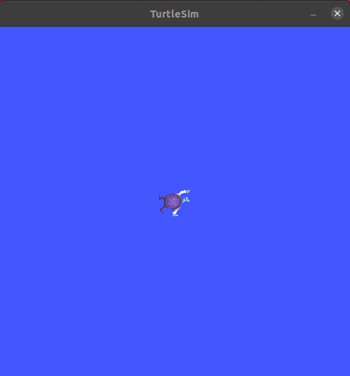
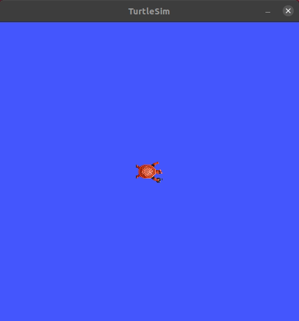
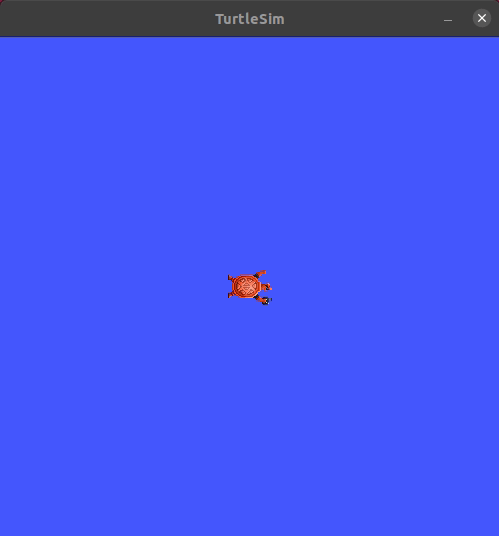
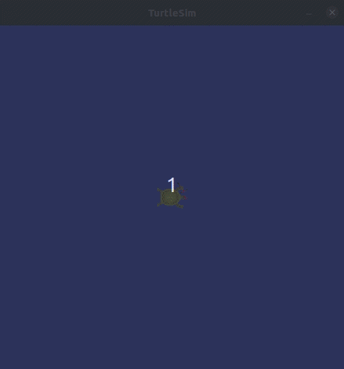
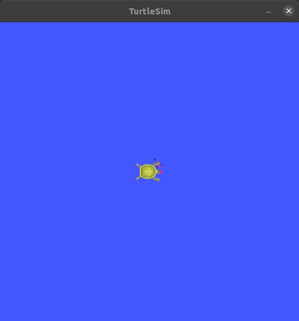
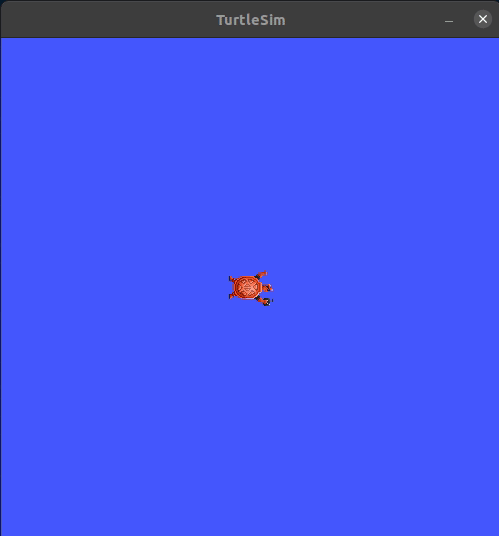

## Package Description  

This repository is a solution for the assignment given in the course [ROS2 For Beginners](https://www.udemy.com/course/ros2-for-beginners/) | Section: 10

**Assignment name**: **`Turtlesim “Catch Them All”`**

---------------------------

## Objective

  * Multiple turtles should  **`spawn`** at random position.  
  * A **`control-turtle`** will try to reach(catch) nearest-turtle, once it reaches the nearest-turtle's present location, nearest-turtle shall be **`removed`**. 


---------------------------

## Requirements

Following are the requirements for the project:
- ROS **`Foxy`** should be installed in the system. 
- **`Turtlesim`** package should be installed. 

to install **`Turtlesim`**, execute the following command:
```console 
sudo apt-get install ros-foxy-turtlesim 
```

### Solution Outline 

- The solution shall be implemented in cpp and python.
- Create a **`ROS 2`** _cpp package_. 
- There will be two nodes. 
- Node 1: 
    * It shall spawn multiple turtles at random location.
- Node 2: 
    * It shall send(publish) appropriate _velocity commands_ for the **`control-turtle`** and will try to reach the nearest-turtle. 
    * Once the control-turtle reaches the nearest-turtle's position, nearest-turtle should be removed.


## Project Status

### Turtle has been spawned at desired position.  
 

### Multiple turtles are spawning at given position.   
 

### Turtles are spawning at random position.  
 

### Control turtle is able to traverse to random pose.  
 

### Control turtle is traversing to spawned turtle's pose.  
 

### Catched turetle is removed. 
 

### catch nearby turtle. 
 
